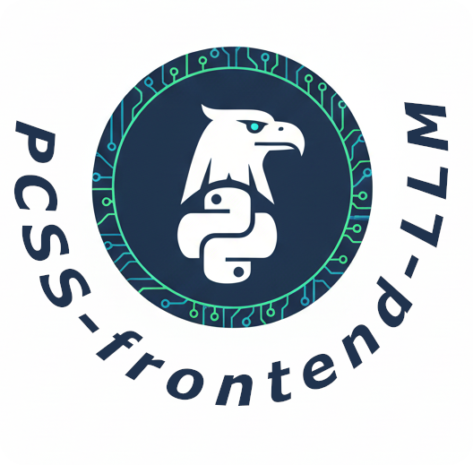

# PCSS LLM Client (Bielik)



A Python desktop application (GUI) for interacting with the PCSS LLM Service, built with **PySide6 (Qt)** and **LangChain**.

## ✨ Key Features

### 1. 💬 Chat Mode
-   **Conversation History**: All chats are saved locally to an SQLite database (`conversations.db`).
-   **Model Selection**: Dynamically fetches models from PCSS (e.g., `bielik-11b-v2.3-instruct`, `gpt-4o`).
-   **Import/Export**: Save and load specific conversations to JSON files.
-   **Markdown Support**: Full rendering of headings, code blocks, and lists.

### 2. 🤖 Agent Mode (Autonomous)
The application features a powerful Agent capable of performing tasks on your local file system.
-   **Workspace Security**: The agent is strictly confined to a specific directory (configurable in settings).
-   **File Tools**: The agent can autonomously using tools:
    -   `ListDirectory`: See files.
    -   `ReadFile`: Read content of files.
    -   `WriteFile`: Create or overwrite files.
    -   `Copy/Move/Delete`: Manage files.
-   **Use Case**: "Read this report.pdf and create a summary.txt" -> Agent does it automatically.

### 3. 🔒 Security
-   **Secure Storage**: API Keys are stored in the system Keyring (macOS Keychain, Windows Credential Locker), never in plain text.
-   **Local Data**: All history and settings are stored locally.
-   **Documentation**: See [MODEL_GUIDE.md](MODEL_GUIDE.md) and [TOOLS_GUIDE.md](TOOLS_GUIDE.md).

## 🛠️ Installation

### Prerequisites
-   **Anaconda** or **Miniconda** installed.
-   Python 3.10+

### Setup Pipeline

1.  **Clone the Repository**
    ```bash
    git clone <repository_url>
    cd Bielik
    ```

2.  **Create Environment**
    You can use the provided `environment.yml`:
    ```bash
    conda env create -f environment.yml
    conda activate bielik
    ```

    *Or manually:*
    ```bash
    conda create -n bielik python=3.10 -y
    conda activate bielik
    pip install pyside6 openai keyring markdown langchain langchain-openai langchain-community pypdf python-docx
    ```

## ⚙️ Configuration

1.  **API Key**: On first launch, enter your PCSS Cloud API Token. It corresponds to your active Grant.
2.  **Workspace**: In **Settings**, select the directory where the Agent is allowed to work (Default: `~/Documents/Bielik_Workspace`).

## ▶️ Usage

```bash
# Activate environment
conda activate bielik

# Run
python pcss_llm_app/main.py
```

### Tips
-   **Chat**: Use `Shift+Enter` for new lines, `Enter` to send.
-   **Agent**: To initialize a session, go to "Agent Mode" -> "Create Assistant" (this boots the LangChain engine). Then type requests like "Create a python script hello.py in my workspace".

## 🏗️ Technology Stack
-   **GUI**: PySide6 (Qt)
-   **LLM Engine**: LangGraph / LangChain
-   **API**: OpenAI Compatible (PCSS)
-   **Database**: SQLite
